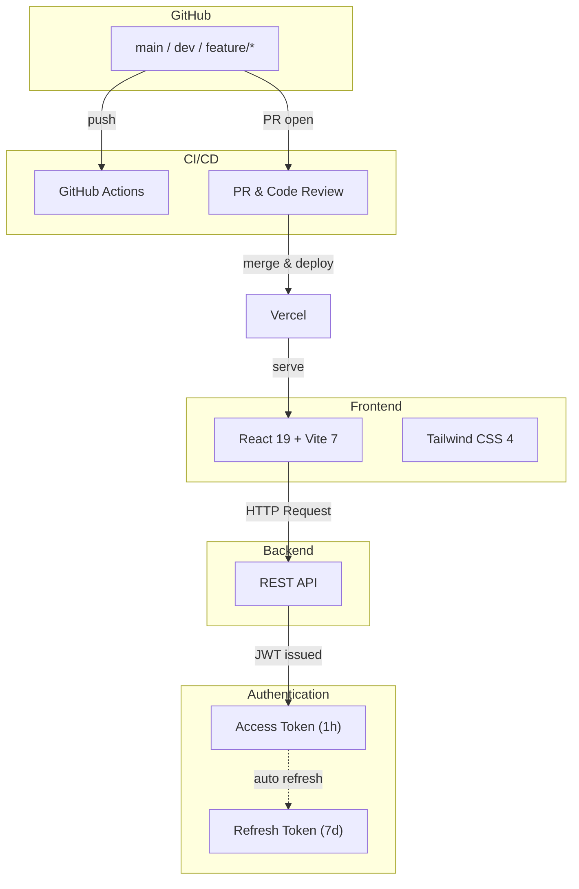

# yurihanWeb

my web portfolio

```mermaid
graph TB
    subgraph GitHub["GitHub"]
        Branch["main / dev / feature/*"]
    end

    subgraph CICD["CI/CD"]
        Actions["GitHub Actions"]
        PR["PR & Code Review"]
    end

    subgraph Frontend["Frontend"]
        React["React 19 + Vite 7"]
        Tailwind["Tailwind CSS 4"]
    end

    subgraph Auth["Authentication"]
        AccessToken["Access Token (1h)"]
        RefreshToken["Refresh Token (7d)"]
    end

    subgraph Backend["Backend"]
        API["REST API"]
    end

    Branch -->|push| Actions
    Branch -->|PR open| PR
    PR -->|merge & deploy| Vercel["Vercel"]
    Vercel -->|serve| React
    React -->|HTTP Request| API
    API -->|JWT issued| AccessToken
    AccessToken -.->|auto refresh| RefreshToken
```
