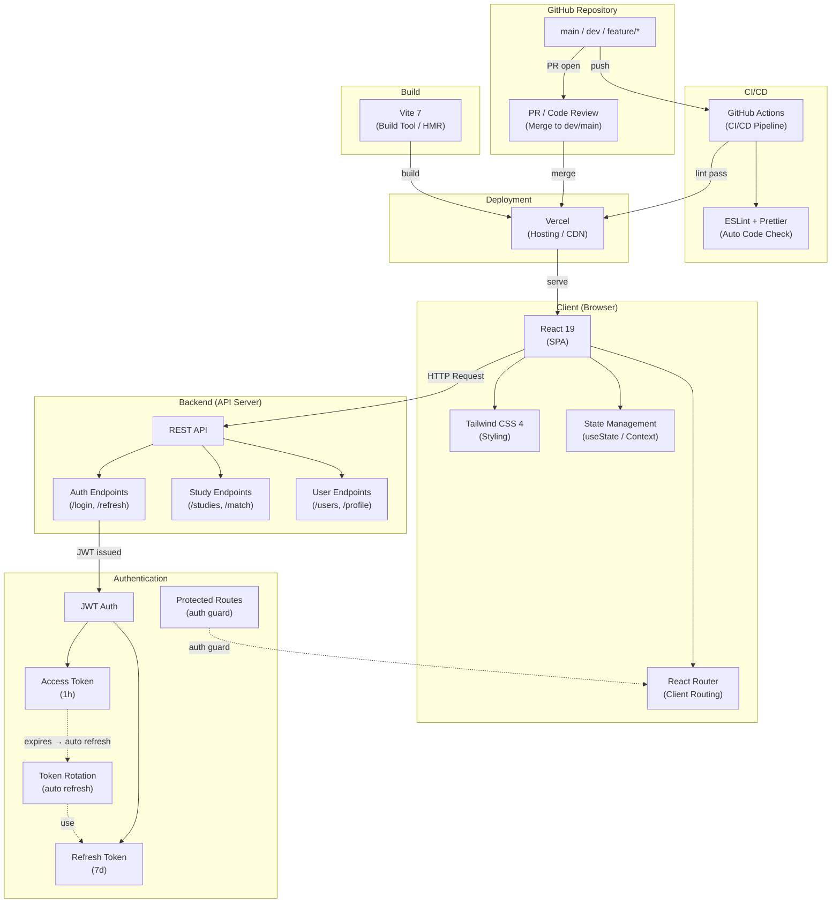

# yurihanWeb

my web portfolio

```mermaid
graph TB
    subgraph GitHub["GitHub Repository"]
        Branch["main / dev / feature/*"]
        PR["PR / Code Review\n(Merge to dev/main)"]
    end

    subgraph CICD["CI/CD"]
        Actions["GitHub Actions\n(CI/CD Pipeline)"]
        Lint["ESLint + Prettier\n(Auto Code Check)"]
    end

    subgraph Deploy["Deployment"]
        Vercel["Vercel\n(Hosting / CDN)"]
    end

    subgraph Client["Client (Browser)"]
        React["React 19\n(SPA)"]
        Router["React Router\n(Client Routing)"]
        Tailwind["Tailwind CSS 4\n(Styling)"]
        State["State Management\n(useState / Context)"]
    end

    subgraph Build["Build"]
        Vite["Vite 7\n(Build Tool / HMR)"]
    end

    subgraph Auth["Authentication"]
        JWT["JWT Auth"]
        AccessToken["Access Token\n(1h)"]
        RefreshToken["Refresh Token\n(7d)"]
        Rotation["Token Rotation\n(auto refresh)"]
        Guard["Protected Routes\n(auth guard)"]
    end

    subgraph Backend["Backend (API Server)"]
        API["REST API"]
        AuthAPI["Auth Endpoints\n(/login, /refresh)"]
        StudyAPI["Study Endpoints\n(/studies, /match)"]
        UserAPI["User Endpoints\n(/users, /profile)"]
    end

    Branch -->|push| Actions
    Branch -->|PR open| PR
    Actions --> Lint
    Actions -->|lint pass| Vercel
    PR -->|merge| Vercel

    Vite -->|build| Vercel
    Vercel -->|serve| React

    React --> Router
    React --> Tailwind
    React --> State
    React -->|HTTP Request| API

    API --> AuthAPI
    API --> StudyAPI
    API --> UserAPI

    AuthAPI -->|JWT issued| JWT
    JWT --> AccessToken
    JWT --> RefreshToken
    AccessToken -.->|expires → auto refresh| Rotation
    Rotation -.->|use| RefreshToken
    Guard -.->|auth guard| Router
```
